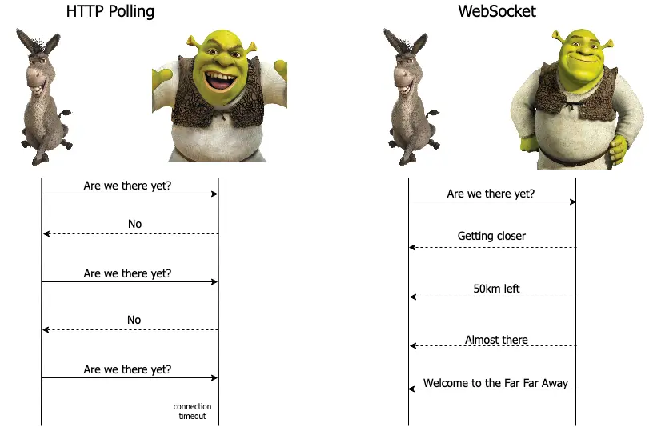

This is a script for workshop about documenting event-driven architectures.

## What is API

It's like a conversation interface, but for the digital world.

- Do you like when people call you `Mr/Mrs/Miss`?
- What is your pronoun?
- Do you care about your titles, should we say `doctor` or `professor`
- Do you want to be asked a question you do not have an answer to?

Wouldn't it be nice to have it documented and publicly available?

## Sync vs Async



## Specifications

* HTTP protocol -> [OpenAPI](https://github.com/OAI/OpenAPI-Specification)
* Async-related protocols -> [AsyncAPI](https://github.com/asyncapi/spec) 

## Event Driven Architecture (EDA)

Q: Why do you do event-driven API, is REST API not enough?
A: Because I want to know what is happening in real-time without asking

## EDA Docs

- Most complex to document because of different protocols
- Not widely visible as REST API
  - Programableweb
  - RapidAPI
  - APITracker -> https://www.apitracker.io/specifications/asyncapi

## EDA actors - simplified

* Client -> server
* Producer, consumer and message broker in the middle

## EDA protocols

amqp, http, ibmmq, jms, kafka, anypointmq, mqtt, secure-mqtt, solace, stomp, ws, mercure

## EDA examples in real life

### Internet of Things (IoT)

#### Robots

- [ZoraBots](https://zorabots.be/)(using AsyncAPI) -> https://docs.zoracloud.com/dev-mqtt-docs/latest/ -> MQTT

#### Platforms

- [Adafruit.io](https://io.adafruit.com/) -> https://io.adafruit.com/api/docs/mqtt.html#adafruit-io-mqtt-api -> MQTT
- [beebotte](https://beebotte.com/) -> https://beebotte.com/docs/mqtt -> MQTT/Websocket
- [ThingScale](https://thingscale.io/) -> https://sensinics.atlassian.net/wiki/spaces/TD/pages/491639/Using+MQTT#MQTT-Endpoint -> MQTT
- [ClearBlade IoT Platform](https://docs.clearblade.com/v/4/messaging/) -> https://docs.clearblade.com/v/4/messaging/ -> MQTT

#### Tracking

- [Sewio](https://www.sewio.net/) -> https://docs.sewio.net/docs/websockets-api-3244447.html -> WebSocket

#### Drones

- [Parrot](https://www.parrot.com/) -> https://developer.parrot.com/docs/sequoia/#websocket - WebSocket

### Messaging/Chat

- [Mailsac](https://mailsac.com/) -> https://mailsac.com/docs/api/#tag/Web-Sockets -> WebSocket TODO
- [Restream.io](https://restream.io) -> https://developers.restream.io/docs#chat-getting-started -> WebSocket
- [Rocket.chat](https://rocket.chat/) -> https://developer.rocket.chat/reference/api/realtime-api -> WebSocket
- [Slack](https://slack.com)(using AsyncAPI) -> https://api.slack.com/rtm -> WebSocket
- [RevAI](https://rev.ai/) -> https://docs.rev.ai/api-hipaa/streaming/ -> WebSocket

### FinTech

- [Bitstamp](https://www.bitstamp.net/) -> https://www.bitstamp.net/websocket/v2/ -> WebSocket
- [The Rock Trading](https://therocktrading.com/en/) -> https://api.therocktrading.com/doc/websocket/index.html -> WebSocket
- [Gate.io](https://www.gate.io/) -> https://www.gate.io/api2 -> WebSocket
- [Alpaca](https://alpaca.markets/) -> https://alpaca.markets/docs/api-references/market-data-api/news-data/realtime/ -> WebSocket
- [Gemini](https://www.gemini.com/) -> https://docs.gemini.com/websocket-api/#market-data Websocket
- [Kraken](https://www.kraken.com/) -> https://docs.kraken.com/websockets/ Websocket

### Internal Microservice Messaging

- Kafka protocol  - no examples, internal, secret

### Sports

- [Game Score Keeper](https://gamescorekeeper.com/) -> https://docs.gamescorekeeper.com/#live_api_2_0 -> WebSocket

### Potential use case

- Weather -> https://ably.com/hub/ably-openweathermap/weather

## Get hands dirty

Let's play with some API. There is no better way to understand what API is other than playing with it and seeing it in action.

### Prerequisites

You need some software installed first.

#### CLI

Install [websocat](https://github.com/vi/websocat#installation) to perform WebSocket request from your terminal

#### Browser

- Get [Postman](https://www.postman.com/) account to use Postman Workspaces
- Install [Postman Desktop Agent](https://www.postman.com/downloads/postman-agent/) to perform WebSocket requests

### Play with WebSocket API from Kraken

#### WebSocat

1. Establish a connection with the API
    ```bash
    websocat wss://ws.kraken.com
    ```
2. Ping the API to see if it responds. Just type the below message and hit Enter:
    ```bash
    {"event": "ping"}
    ```
3. Now subscribe to the event `ticker` stream that sends messages with currency price. Just type the below message and hit Enter:
    ```bash
    {  "event": "subscribe",  "pair": [    "XBT/USD",    "XBT/EUR"  ],  "subscription": {    "name": "ticker"  }}
    ```
4. You should now see a constant stream of data sent by the server. You do not have to ask the API every second for an update, as the update is pushed to you.

5. Now unsubscribe from info about one currency pair. Just type the below message and hit Enter:
    ```bash
    {    "event": "unsubscribe",    "pair": [        "XBT/USD"    ],    "subscription": {        "name": "ticker"    }}
    ```
6. You should see a message that you unsubscribed and the rest of the stream is just about EUR

#### Postman

1. Go to [this Postman Workspace with WebSocket APIs](https://www.postman.com/derberg/workspace/websocket-apis-mix)
2. Use `Kraken API` collection to first just ping the server and then to also send subscribe and unsubscribe messages


